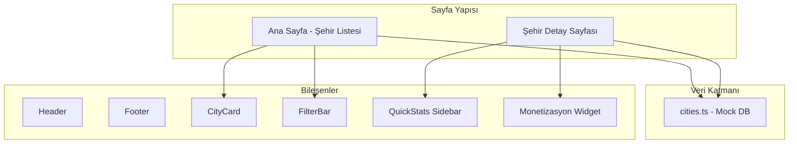

# NomadPoint - Dijital Göçebe Şehir Rehberi Platformu

## Proje Genel Bakış

Global dijital göçebeler için internet hızı, yaşam maliyeti ve vize bilgilerine odaklanan, SEO optimize edilmiş bir şehir dizini platformu.




## Teknik Yığın

| Teknoloji | Kullanım ||-----------|----------|| Next.js 14 | App Router ile SSG/SSR || TypeScript | Tip güvenliği || Tailwind CSS | Stil yönetimi || Lucide React | İkon kütüphanesi |

## Tasarım Sistemi

- **Arka Plan:** `#F9FAFB`
- **Ana Vurgu Rengi:** `#0066FF`
- **Estetik:** Tech-minimalist, temiz ve modern
- **Responsive:** Mobile-first yaklaşım

---

## Klasör Yapısı

```javascript
NomadPoint/
├── src/
│   ├── app/
│   │   ├── layout.tsx          # Ana layout (Header + Footer)
│   │   ├── page.tsx            # Ana sayfa (Şehir dizini)
│   │   ├── globals.css         # Global stiller
│   │   └── cities/
│   │       └── [slug]/
│   │           └── page.tsx    # Dinamik şehir detay sayfası
│   ├── components/
│   │   ├── Header.tsx
│   │   ├── Footer.tsx
│   │   ├── CityCard.tsx
│   │   ├── FilterBar.tsx
│   │   ├── QuickStats.tsx
│   │   └── AffiliateWidget.tsx
│   ├── data/
│   │   └── cities.ts           # Mock veritabanı
│   └── types/
│       └── city.ts             # TypeScript tipleri
├── public/
│   └── images/
│       └── cities/             # Şehir görselleri
├── package.json
├── tsconfig.json
├── tailwind.config.ts
├── next.config.js
└── README.md
```

---

## Uygulama Adımları

### Adım 1: Proje Kurulumu

- Next.js 14 projesi oluştur (App Router)
- Tailwind CSS yapılandır
- Lucide React kur
- TypeScript ayarları

### Adım 2: Veri Katmanı

[`src/data/cities.ts`](src/data/cities.ts) dosyası:

```typescript
interface City {
  id: string;
  slug: string;
  name: string;
  country: string;
  continent: string;
  internetSpeed: number;      // Mbps
  monthlyCost: number;        // USD
  safetyScore: number;        // 1-5
  visaAvailable: boolean;
  shortDescription: string;
  longDescription: string;    // HTML/Markdown
  heroImage: string;
}
```

Başlangıç şehirleri: **Bali, Lisbon, Bansko, Medellin, Istanbul**

### Adım 3: Temel Bileşenler

- **Header:** Logo + navigasyon
- **Footer:** Telif hakkı + linkler
- **CityCard:** Şehir kartı (isim, ülke, 3 ikon: WiFi/Dolar/Kalkan)
- **FilterBar:** "Yüksek Hızlı Internet (>50 Mbps)" ve "Bütçe Dostu (<$1500)" filtreleri

### Adım 4: Ana Sayfa

[`src/app/page.tsx`](src/app/page.tsx):

- **Hero Section:** "Find Your Next Remote Work Hub." başlığı
- **Filtreleme Sistemi:** Hızlı filtreler
- **Şehir Grid'i:** Responsive kart dizisi

### Adım 5: Şehir Detay Sayfası

`[src/app/cities/[slug]/page.tsx](src/app/cities/[slug]/page.tsx)`:

- **Hero Görsel:** Tam genişlikte şehir fotoğrafı
- **2 Sütunlu Layout:**
- Sol: "Why [City]?" detaylı içerik
- Sağ: Sticky "Quick Stats" sidebar
- **Monetizasyon Widget'ları:**
- SafetyWing (Sağlık Sigortası)
- Booking.com (Konaklama)
- NordVPN (VPN)

### Adım 6: SEO Optimizasyonu

- Next.js Metadata API kullanımı
- Title pattern: `"[City] Digital Nomad Guide: Internet, Costs & Visas | NomadPoint"`
- Open Graph ve Twitter Card meta etiketleri
- `generateStaticParams` ile statik sayfa üretimi
- Next.js `<Image />` komponenti ile görsel optimizasyonu

---

## Sayfa Akışı

```mermaid
flowchart LR
    User[Kullanıcı] --> Home[Ana Sayfa]
    Home --> Filter[Filtre Uygula]
    Filter --> Grid[Şehir Grid]
    Grid --> Card[Şehir Kartı Tıkla]
    Card --> Detail[/cities/bali]
    Detail --> Stats[Quick Stats]
    Detail --> Affiliate[Affiliate Linkler]
```

---